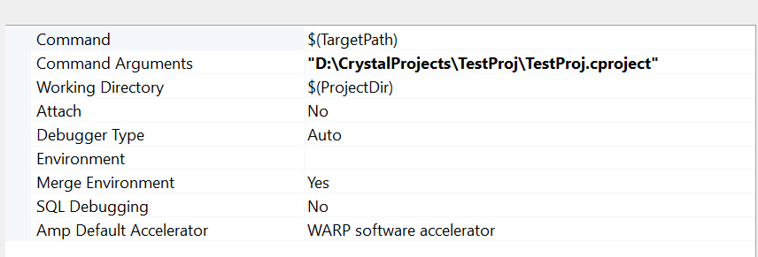

# Building

The engine can be built in either of these 2 configurations:
* Editor/Host mode (**required**): Builds the host tools along with the engine run-time.
* Standalone mode: Builds only the engine runtime, but requires access to the built host tools.

Currently, both Windows and macOS are supported. But macOS is not the primary focus, hence you might experience build errors.

## Prerequisites

The following is required to be installed to your computer along with environment variables set up.

- Git for windows (only on windows): This is required for using the bash shell that comes with it. Make sure the folder containing sh.exe is added to the PATH environment variable.
- Vulkan SDK: Recommended version is 1.3.275.
- CMake: Use the one that comes with Visual Studio.
- Visual Studio 2022 OR Xcode.
- Visual Studio Code (optional).

## Building Host tools (required)

Run the following cmake command to make host build from the project's root directory. (Replace windows with your host platform)

```sh
cmake -B Build/Windows -S . -G "Visual Studio 17 2022" -Wno-dev
```

Now, you can either build the host tools and other targets through visual studio or Xcode, or you can run the following command to build instead. Note: It's recommended to use **debug** builds in case you experience issues with Development or Release builds.
Host tools are command line tools used by standalone platform build. Hence they must be built before doing standalone build.

```sh
cmake --build Build/Windows --config Debug --target HostTools -Wno-dev
```

**Recommended**: However, if you want to build the editor GUI tools, you can either build and run the `EditorLauncher` target from Visual studio, or via command line:

```sh
cmake --build Build/Windows --config Debug --target EditorLauncher -Wno-dev
```

### Important Note

The `EditorLauncher` executable launches the Project Browser by default. If you've already created a project once and want to launch the project by default on launch, then pass the path to your `.cproject` file in the command line arguments when running it through Visual Studio like this:

<p align="center">
    
</p>

## Building standalone (optional)

The standalone build has the GameSystem_Test application, which you can run to play-test the engine in standalone mode.

```sh
cmake -B Build/Windows-Standalone -S . -DCE_STANDALONE=ON -DCE_HOST_BUILD_DIR="<Path To host tools binary dir>" -DCMAKE_SYSTEM_NAME=Windows -Wno-Dev
```

The path to host tools binary directory in our situation is:
`C:/CrystalEngine/Build/Windows/Debug`. `Build/Windows` is the host tools solution directory, and the binary files will be produced in the Debug folder, if you have chosen to build Debug target for host tools.

Note: For now, there is no real use of standalone builds, and they are incomplete yet. You can run the `GameSystem_Test` target in standalone build to do a basic play test of the standalone engine.

