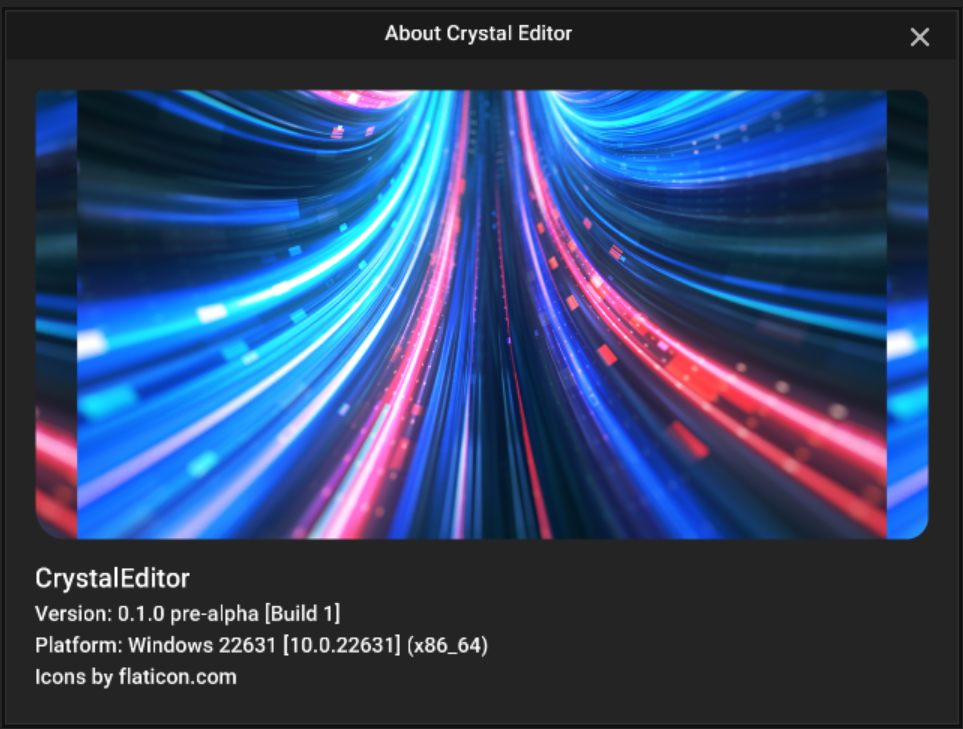

# Crystal Widgets

The crystal widgets module is a widget gui library that is used in Crystal Editor itself.
It exists in the engine domain, which means it can be used by runtime standalone builds too.

Crystal widgets lets you create widgets in C++ and use CSS for styling and flex layout. It uses the 2D renderer from the CoreRPI to draw the widgets.

All widgets derive from the CWidget class, including CWindow. And all windows derive from CWindow class.

#### Event handling

The CWidget class has a virtual function called `void HandleEvent(CEvent* event)` which is called by the widgets event system. 
Currently, there are a few different type of events, like mouse events, focus events, key events, drag events and paint event.

## Features

- Qt-like Widget library to build GUI applications used by Crystal Editor.
- Use CSS to style and layout the widgets. (Not all CSS features are supported)

## About Window Example

This is how the Crystal Editor creates the About window. You can use this as an example.



```c++
// AboutWindow.h
#pragma once

namespace CE::Editor
{
    CLASS()
    class CRYSTALEDITOR_API AboutWindow final : public CToolWindow
    {
        CE_CLASS(AboutWindow, CToolWindow)
    public:

        AboutWindow();

        virtual ~AboutWindow();

    private:

        void OnPlatformWindowSet() override;

        void Construct() override;

    };
    
} // namespace CE::Editor

#include "AboutWindow.rtti.h"
```

```c++
// AboutWindow.cpp

#include "CrystalEditor.h"

namespace CE::Editor
{

	AboutWindow::AboutWindow()
	{
		title = "About Crystal Editor";

		canBeClosed = true;
		canBeMaximized = canBeMinimized = false;
	}

	AboutWindow::~AboutWindow()
	{
		
	}

	void AboutWindow::OnPlatformWindowSet()
	{
		Super::OnPlatformWindowSet();

		if (nativeWindow)
		{
			nativeWindow->SetAlwaysOnTop(true);
		}
	}

	void AboutWindow::Construct()
	{
		Super::Construct();

		LoadStyleSheet(PlatformDirectories::GetLaunchDir() / "Editor/Styles/AboutWindowStyle.css");
		
		CWidget* splash = CreateObject<CWidget>(this, "Splash");
		splash->SetBackgroundImage("/Editor/Assets/Images/Splash");

		CLabel* titleLabel = CreateObject<CLabel>(this, "TitleLabel");
		titleLabel->SetText("CrystalEditor");

		CLabel* desc1 = CreateObject<CLabel>(this, "Desc1");
		desc1->SetText("Version: " CE_ENGINE_VERSION_STRING_SHORT " pre-alpha [Build " CE_TOSTRING(CE_VERSION_BUILD) "]");

		CLabel* desc2 = CreateObject<CLabel>(this, "Desc2");
		desc2->SetText("Platform: " + PlatformMisc::GetOSVersionString());

		CLabel* attributionLabel = CreateObject<CLabel>(this, "AttributionLabel");
		attributionLabel->SetText("Icons by flaticon.com");
	}

} // namespace CE::Editor
```

AboutWindowStyle.css
```css
/* 
* Also look at the Editor Styles css at Editor/Styles/EditorStyle.css,
* Because it serves as the base stylesheet for all editor widgets.
*/

AboutWindow {
    background: rgb(36, 36, 36);
    padding: 20px 20px;
    row-gap: 5px;
}

AboutWindow #Splash {
    /* Background image properties similar to CSS */
    background-size: contain;
    background-position: middle-center;
    background-repeat: repeat;
    border-radius: 5px 10px 15px 20px;
    width: 100%;
    height: 300px;
    margin: 0 0 0 10px;
}

#AttributionLinks {
    font-size: 14px;
}
```


