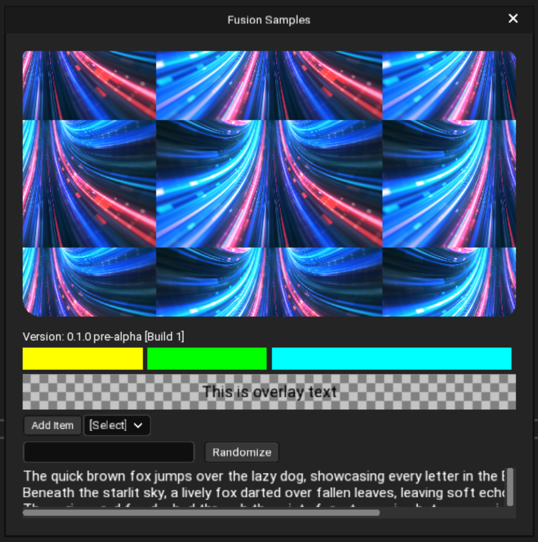

# Fusion Widgets

Fusion is a declarative C++ widget library that powers the Crystal Editor itself using a builtin 2D renderer. In future, it will be modified to be used for game's GUI.

Fusion lets you create widgets in C++ using declarative syntax and apply flexible styling on them.

## Features

* Declarative UI structure.
* Texture support: Use textures to draw icons and images with custom scaling and tiling.
* Fast 2D renderer with 2D clipping implemented on both CPU and GPU.
* Uses builtin 2D renderer that uses instancing to draw almost all widgets in a single draw call and submits draw list to CoreRPI.
* Styling: Flexible styling using `FStyle` and `FStyleSet`.
* Flexible layout: Use layouts like FStackBox, FOverlayStack, FCompoundWidget, FSplitBox, etc to create complex layouts.
* Simple data binding between widget and model classes.
* Create custom widgets with your own declarative properties with `FUSION_PROPERTY()` and other macros.

## Example

If you are running the Crystal Editor, you can go to Help menu and click "Fusion Samples" to open this sample:



You can take a look at the cpp file below to see the full implementation
[/Editor/Source/CrystalEditor/Private/CrystalEditor/Windows/Misc/SampleWidgetWindow.cpp](/Editor/Source/CrystalEditor/Private/CrystalEditor/Windows/Misc/SampleWidgetWindow.cpp)

Here is the Construct() function that builds the widget:

```c++
void SampleWidgetWindow::Construct()
{
    Super::Construct();

    titleBar->Height(30);
    titleBarLabel->FontSize(13);

    constexpr auto splashImage = "/Editor/Assets/Images/Splash";
    constexpr auto gridImage = "/Editor/Assets/Images/GridSmall";

    instance = this;

    FBrush splash = FBrush(splashImage);
    splash.SetBrushTiling(FBrushTiling::TileXY);
    splash.SetImageFit(FImageFit::Contain);
    splash.SetBrushPosition(Vec2(0.5f, 0.5f)); // 50%, 50%
    splash.SetBrushSize(Vec2(256, 144));

    FBrush grid = FBrush(gridImage);
    grid.SetBrushTiling(FBrushTiling::TileXY);
    grid.SetBrushSize(Vec2(20, 20));


    (*this)
        .Title("Fusion Samples")
        .MinimizeEnabled(false)
        .MaximizeEnabled(false)
        .ContentPadding(Vec4(1, 1, 1, 1) * 20)
		.ContentGap(5)
        .Content(
            FNew(FImage)
            .Background(splash)
            .BackgroundShape(FRoundedRectangle(5, 10, 15, 20))
            .HAlign(HAlign::Fill)
            .Height(300)
            .Margin(Vec4(0, 0, 0, 10)),

            FNew(FLabel)
            .FontSize(13)
            .Text("Version: " CE_ENGINE_VERSION_STRING_SHORT " pre-alpha [Build " CE_TOSTRING(CE_VERSION_BUILD) "]")
            .HAlign(HAlign::Left),

            FNew(FSplitBox)
            .ContentVAlign(VAlign::Center)
            .HAlign(HAlign::Fill)
            .Name("DebugSplitBox")
            (
                FNew(FStyledWidget)
                .Background(Color::Yellow())
                .Height(25)
                .FillRatio(0.25f),

                FNew(FStyledWidget)
                .Background(Color::Green())
                .Height(25)
                .FillRatio(0.25f),

                FNew(FStyledWidget)
                .Background(Color::Cyan())
                .Height(25)
                .FillRatio(0.5f)
            ),

            FNew(FOverlayStack)
            .ContentVAlign(VAlign::Center)
            .HAlign(HAlign::Fill)
            (
                FNew(FStyledWidget)
                .Background(grid)
                .Height(40),

                FNew(FLabel)
                .Text("This is overlay text")
                .FontSize(18)
                .Bold(true)
                .Foreground(Color::Black())
                .HAlign(HAlign::Center)
            ),

            FNew(FHorizontalStack)
            .ContentVAlign(VAlign::Center)
            .ContentHAlign(HAlign::Left)
            (
                FNew(FTextButton)
                .Text("Add Item")
                .OnClicked([this]
                {
                    Array<String> list = model->GetItemList();
                    list.Add(String::Format("Item {}", list.GetSize()));
                    model->SetItemList(list);
                }),

                FNew(FComboBox)
                .Bind_Items(BIND_PROPERTY_R(model, ItemList))
                .MinWidth(60)
            ),

            FNew(FHorizontalStack)
            .ContentVAlign(VAlign::Center)
            .ContentHAlign(HAlign::Left)
            (
                FNew(FTextInput)
                .Bind_Text(BIND_PROPERTY_RW(model, Text))
                .FontSize(13)
                .Width(180)
                .Margin(Vec4(0, 0, 10, 0)),

                FNew(FTextButton)
                .FontSize(13)
                .Text("Randomize")
                .OnClicked([this]
                    {
                        model->ModifyTextInCode();
                    }),

                FNew(FLabel)
                .FontSize(13)
                .Bind_Text(BIND_PROPERTY_R(model, Text))
            ),

            FNew(FScrollBox)
            .VerticalScroll(true)
            .HorizontalScroll(true)
            .FillRatio(1.0f)
            (
                FNew(FVerticalStack)
                .VAlign(VAlign::Top)
                .HAlign(HAlign::Left)
                (
                    FNew(FLabel)
                    .Text("The quick brown fox jumps over the lazy dog, showcasing every letter in the English alphabet.")
                    .FontSize(16),

                    FNew(FLabel)
                    .Text("Beneath the starlit sky, a lively fox darted over fallen leaves, leaving soft echoes in the quiet woods.")
                    .FontSize(16),

                    FNew(FLabel)
                    .Text("The curious red fox dashed through the misty forest, weaving between ancient trees with nimble grace.")
                    .FontSize(16),

                    FNew(FLabel)
                    .Text("With a flick of its tail, the agile fox bounded across the meadow, vanishing into the evening shadows.")
                    .FontSize(16)
                )
            )
        );
}
```

