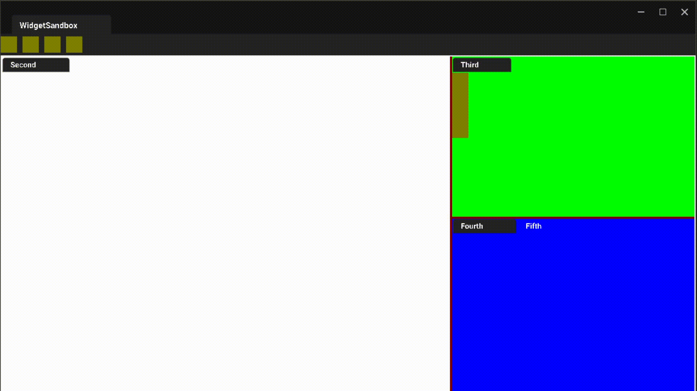

# Crystal Engine

A Work-in-progress Vulkan game engine with PBR rendering, FrameGraph based render architecture, and a Widget library that uses CSS & Yoga Layout engine.

PBR Demo            |  Widgets Demo
:-------------------------:|:-------------------------:
  |  

## Requirements

Only Windows and macOS are supported. However, macOS builds are experimental and may fail.

## Building

Please look at the [Build.md](./Docs/Build.md) to know the steps & dependencies required to build.

## Features

- A modular architecture, where the engine is split into multiple modules that are loaded & unloaded as dynamic libraries.
- A custom runtime reflection system to reflect classes, structs and plain data types using either simple macros or automatically through AutoRTTI tool.
- A FrameGraph based render pipeline which allows you to build a complex graph with lots of passes which can be executed parallely on different GPU queues.
- **CrystalWidgets**: Build a UI widget application that uses CSS for styling & flex-box layout.
- AssetProcessor can process shader and texture assets. In case of HDR files, it will automatially convert it into a cubemap and generate the diffuse & specular convolution required for Image Based Lighting (IBL).
- All assets are stored in a custom Binary format for fast deserialization!

## Modules Overview

The engine is divided into different domains, and each domain can have multiple modules.

#### Core domain
All modules inside the core domain are at the low level of the engine.

* **Core module**: The foundation of the engine. Provides runtime type reflection system, Binary & JSON serialization, containers, Object system, Job System, etc.
* **CoreApplication**: Low level application layer to handle OS application specific things. Uses SDL2 underneath the abstractions.
* **CoreMedia**: Low level image handling and BC1-7 compression.
* **CoreShader**: Low level shader compilation and reflection. Uses DxCompiler & spirv reflect.
* **CoreRHI**: Rendering Hardware Interface. A graphics API abstraction layer that is used for low level GPU operations. Also implements frame graph rendering.
    * **VulkanRHI**: Vulkan implementation of the RHI layer.
* **CoreRPI**: Render Pipeline Interface. Provides a render pipeline architecture layer on top of RHI, allowing engine to build complex render pipeline with many passes.

#### System domain
System domain modules are at high level of the engine.

* **CrystalWidgets**: Widgets library used to build GUI applications with CSS & FlexBox. Uses CoreRPI for 2D rendering.
* **System module**: The main module that contains the high level game engine systems, game framework, etc.
* **GameSystem**: Only for standalone builds. Runtime implementation of System module.

#### Editor domain

There's no actual GUI editor that exists yet. It's only CLI tools like AssetProcessor, AutoRTTI, ResourceCompiler, etc.

* **EditorCore**: Implements Asset processing and serves as the foundation of the editor & host tools.
* **EditorSystem**: Host/editor implementation of the System module.

