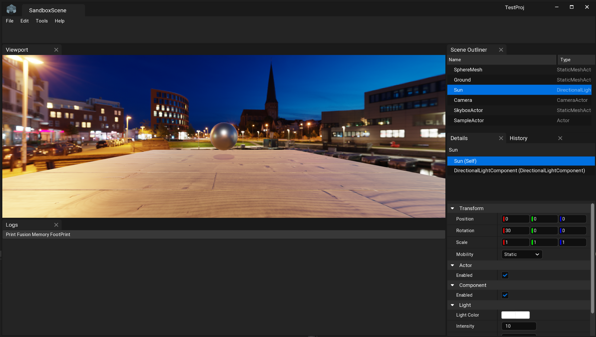

# Crystal Engine

A Work-in-progress Vulkan game engine with PBR rendering, FrameGraph based render architecture, and a declarative syntax Widget GUI framework that is used by the editor.

### Check more [screenshots below](#screenshots).

### Check out [Fusion widget library](./Docs/FusionWidgets.md).

## Requirements

Only Windows is supported for now. Although, the Core libraries compile on macOS too.

## Building

Please look at the [Build.md](./Docs/Build.md) to know the steps & dependencies required to build.

## Features

- Modular engine architecture.
- Use HLSL to write shaders for Vulkan.
- Forward PBR rendering with CubeMap IBL.
- Directional shadow maps.
- Multi-threaded job system, used in Asset Processing.
- Asset processing to generate binary assets for use by engine.
- Automatic C++ runtime reflection generation.
- Object serialization: Custom binary format and JSON.
- Frame graph based GPU scheduling with automatic resource dependencies.
- **Fusion** framework for declarative GUI apps with text & SDF geometry rendering.
- **Fusion** uses the engine's builtin renderer instead of 3rd party imgui frameworks.

## Modules Overview

The engine is divided into different domains, and each domain can have multiple modules.

### Core domain
All modules inside the core domain are at the low level of the engine.

* **Core**: The foundation of the engine. Provides runtime type reflection system, Binary & JSON serialization, containers, Object system, Job System, etc.
* **CoreApplication**: Low level application layer to handle OS specific application & windowing. Uses SDL2 underneath the abstractions.
* **CoreInput**: Low level input handling.
* **CoreMedia**: Low level image handling and BC1-7 compression.
* **CoreMesh**: Low level mesh loading.
* **CoreShader**: Low level shader compilation and reflection. Uses DxCompiler & spirv reflect.
* **CoreRHI**: Rendering Hardware Interface. A graphics API abstraction layer that is used for low level GPU operations. Also implements frame graph rendering.
    * **VulkanRHI**: Vulkan implementation of the RHI layer.
* **CoreRPI**: Render Pipeline Interface. Provides a render pipeline architecture layer on top of RHI, allowing engine to build complex render pipeline with many passes.
* **FusionCore**: Widgets library used to build GUI applications with declarative syntax.
* **Fusion**: Adds more high level Fusion widgets like TreeView, ListView and more.

### System domain

System domain modules are at high level of the engine.

* **System**: The main module that contains the high level game engine systems, game framework, etc.
* **GameSystem**: Only for standalone builds. Runtime implementation of System module.

### Editor domain

Contains all the editor modules.

* **EditorCore**: Implements Asset processing and serves as the foundation of the editor & host tools.
* **EditorSystem**: Host/editor implementation of the System module i.e. Engine.
* **CrystalEditor**: Contains all the editor related GUI and features and uses Fusion for the widgets.

# Screenshots

### Project browser window:

### PBR Demo:

### Credits

<a href="https://www.flaticon.com/">Icons by FlatIcon - flaticon.com</a>

This project includes some code, both original and modified, from the O3DE project (https://github.com/o3de/o3de) under the MIT License.

Other than that, all the systems in the engine, like object system, Reflection, Seralization, Fusion Widget library, etc are entirely our own implementation. While it may draw conceptual inspiration from other frameworks, all code and algorithms have been developed independently.

